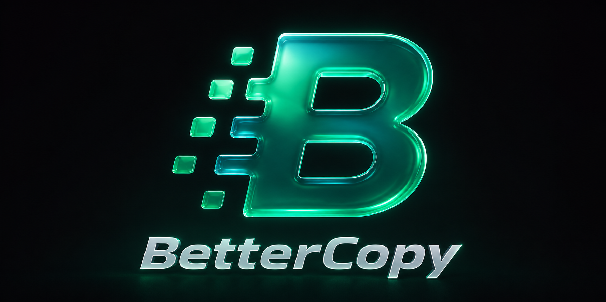

# BetterCopy



[](LICENSE)
[](https://microsoft.com)
[](https://www.rust-lang.org/)

**BetterCopy** is an auto-tuning, parallel copy and delete engine for Windows. It provides a blistering-fast replacement for native file copy and delete operations, bound directly to global hotkeys (**`Ctrl+Shift+V`** for paste and **`Ctrl+Shift+Delete`** for delete) that activate only when you focus Windows Explorer or the Desktop.

> BetterCopy is designed to maximize speed on modern solid-state storage (NVMe, SSDs, UASP USBs). It does not improve copy or delete performance on mechanical hard drives (HDDs), where the engine auto-detects seek-penalty characteristics and safely falls back to single-threaded sequential execution to prevent disk head thrashing.

---

## ✦ The Philosophy

BetterCopy is designed to have the **largest impact on typical Windows file copy performance with the least effort by the user**. 

It does not compete with feature-heavy power-user tools like TeraCopy or FastCopy, nor does it aim to support complex environments like cloud drives. The goal is to make copying better for the typical user without them ever having to think about it.

It is built around a simple, uncompromising brand promise:
* **No Admin:** Runs entirely in user space. No elevation prompts, no UAC bypasses.
* **No Injection:** Zero DLL injection into `explorer.exe` or hooking of `SHFileOperation`.
* **No Residue:** No background services, tray clutter, or leftover registry junk.
* **Low Footprint:** CPU usage is near-zero when idle (~0.01% from the background daemon polling 100x/sec for focus/hotkeys). Memory usage sits at ~30–50MB of RAM (required to keep the Tauri/WebView2 dashboard engine pre-warmed for instant paste response).

---

## ✦ Product Positioning

BetterCopy occupies a unique sweet spot in the file-transfer ecosystem, bridging the gap between raw command-line performance and seamless native consumer usability:

| Dimension | Standard Windows Copy | CLI Tools (Robocopy / Rsync) | Shell Replacements (TeraCopy / FastCopy) | BetterCopy |
| :--- | :--- | :--- | :--- | :--- |
| **Speed (Tiny Files)** | 🐌 Slow (Sequential I/O) | ⚡ Fast (Parallelized) | ⚡ Fast (Parallelized) | ⚡ **Fast (Parallelized)** |
| **Interface** | Native & Seamless | CLI Only (Shell/Scripts) | Heavy custom GUI / Overlay | **Transient Dashboard (Auto-dismisses)** |
| **Trigger** | `Ctrl+V` / `Shift+Delete` | Manual command invocation | Overrides standard copy handlers | **`Ctrl+Shift+V` / `Ctrl+Shift+Delete` (Focus-gated)** |
| **System Residue** | None (Built-in) | None | System services & registry hooks | **None (No admin required, zero residue)** |
| **Security Footprint** | None | None | DLL Injection / Shell Hooks (Trips AV) | **None (Safe native Win32 & COM APIs)** |
| **Configuration** | Zero Config | Complex flags (`/MT`, `/J`, `/E`) | Manual buffer & cache size tuning | **Zero Config (IOCTL-based Auto-Tuning)** |

---

## ✦ How It Works

Windows Explorer copies files sequentially, one-by-one. Third-party tools either require you to use their own clunky file manager or inject dangerous hooks into the Windows shell. BetterCopy offers a third way:

1. **Focus-Gated Trigger:** A lightweight message-only Win32 window registers global hotkeys (`Ctrl+Shift+V` for paste and `Ctrl+Shift+Delete` for delete). 
2. **Context Gating:** It listens to native Windows focus events (`SetWinEventHook`) to ensure hotkeys are only active when Windows Explorer (`CabinetWClass`) or the Desktop is in the foreground. If you are renaming a file or focused in another application, the keystrokes pass through naturally.
3. **COM Path & Selection Resolution:** When triggered, it queries the active Explorer window via COM APIs (`IShellWindows` ➔ `IFolderView2`) to find exactly where your cursor is focused:
   * **For Copy/Move:** It reads the source files from your clipboard (`CF_HDROP`) and starts copying to the resolved destination.
   * **For Delete:** It queries the currently selected items via COM (`GetSelection`), maps them to filesystem paths, and deletes them in parallel.
4. **Auto-Tuning Engine:** It queries physical storage geometries using Win32 storage IOCTLs:
   * **NVMe SSDs:** Automatically ramps up thread concurrency (16 threads by default) to maximize queue depth.
   * **HDDs:** Safely falls back to single-threaded sequential copying to prevent thrashing.
   * **USB Enclosures:** Detects modern UASP vs. legacy BOT protocols to dynamically optimize I/O.
5. **Dual-Queue Architecture:** Separate worker pools process small (<1MB) and large (>=1MB) files concurrently, preventing massive sequential files from starving tiny files.

---

## ✦ Performance (Sandwich Benchmarks)

We benchmarked BetterCopy against Microsoft's industry-standard `robocopy` using a symmetrical sandwich test structure (exposing SSD write-amplification noise and clearing file-caching drift) with a **100,000 tiny-file fixture (800MB total)**.

| Copy Engine | Commands / Options | Average Time (s) | Speedup vs. Best Robocopy |
| :--- | :--- | :--- | :--- |
| **BetterCopy (`bcopy`)** | Default (Auto-Tuned) | **20.19s** | **1.65x faster** (Baseline) |
| **Robocopy** | `/MT:32` (Threads) | 33.29s | 1.00x |
| **Robocopy** | `/MT:32 /J` (Unbuffered) | 35.80s | 0.93x |
| **Windows Explorer** | Defender Disabled (Manual) | 240s - 300s (4m - 5m) | 0.11x - 0.14x (8x - 9x slower) |

*BetterCopy achieves a **64.9% throughput improvement** over the fastest possible Robocopy configuration, and is **12x to 15x faster** than native Windows Explorer (with Defender disabled) when copying tiny files on NVMe drives.*

> [!WARNING]
> **Benchmarking Disclaimer (n=1):** All benchmark results were collected in a single test environment (n=1) on a **Micron MTFDKBA1T0TFH** NVMe SSD with Windows Defender disabled. Actual performance will vary depending on your drive controller, thermal limits, filesystem overhead, and antivirus active scanning configuration.

---

## ✦ Architecture

```
                 [ Ctrl+Shift+V Global Hotkey ]
                              │
                    ( Gated Focus Check )
                   /                     \
        Active in Explorer?           Focused elsewhere?
               /                             \
    [ COM Path Resolution ]            [ Pass-through Key ]
              │
    [ Auto-Tune Storage Profile ]
    (Query IOCTL Seek Penalty/UASP)
         /                      \
    Spinning Disk?            Internal NVMe / SSD?
       /                          \
[ 1 Thread (Sequential) ]    [ Dual Queues (16 Threads) ]
                              ├── Small Files (<1MB)
                              └── Large Files (>=1MB) (Unbuffered I/O)
```

---

## ✦ Usage

### Global Hotkey (Copy/Paste)
1. Launch the BetterCopy daemon (`better_copy_gui.exe`).
2. Go to Windows Explorer or your Desktop.
3. Copy one or more folders (`Ctrl+C`).
4. Navigate to your target directory and press **`Ctrl+Shift+V`**.
5. A beautiful, transient Tauri progress dashboard will show the execution plan, speed, and real-time concurrency status.

### Global Hotkey (Delete)
1. Launch the BetterCopy daemon (`better_copy_gui.exe`).
2. Go to Windows Explorer or your Desktop.
3. Select one or more files/folders.
4. Press **`Ctrl+Shift+Delete`**.
5. The Tauri dashboard will pop up, displaying a transient deletion progress bar, delete rate (in files/second), and a live Canvas speed chart.

### Command Line Interface (`bcopy`)
For scripting, automation, or CLI-first workflows:
```bash
# Copy source to destination using the auto-tuned parallel engine
bcopy.exe copy "C:\source\path" "D:\dest\path"

# Move source to destination safely (copy, verify, delete)
bcopy.exe move "C:\source\path" "D:\dest\path"
```

---

## ✦ Building from Source

### Prerequisites
* [Rust](https://www.rust-lang.org/) (Stable channel)
* [Node.js](https://nodejs.org/) & `npm` (for Tauri GUI)
* Windows SDK (for Win32 COM and storage APIs)

### Step-by-Step Build

1. Clone the repository:
   ```bash
   git clone https://github.com/articulite/BetterCopy.git
   cd BetterCopy
   ```

2. Build the CLI engine:
   ```bash
   cargo build --release --bin bcopy
   ```

3. Build and package the GUI app:
   ```bash
   cd better_copy_gui
   npm install
   npm run tauri build
   ```

---

## ✦ FAQ

#### Q: Why does the dashboard show a spinner before the copy starts?
**A:** BetterCopy does a fast, upfront directory traversal and pre-flight checks (disk space, permissions, and folder loops) before copying. This ensures it doesn't fail mid-operation and helps classify files into optimal small/large queues. The actual transfer starts shortly after and is so fast that the total end-to-end time is still much shorter.

#### Q: Why does `Ctrl+Shift+V` sometimes not do anything?
**A:** BetterCopy uses focus-gating. The hotkey only triggers when Windows Explorer or the Desktop is active. If you are renaming a file or focused in another app, the keypress passes through naturally.

#### Q: Does it support network drives / UNC paths?
**A:** Yes. BetterCopy supports network/UNC drives. The engine auto-detects remote drives and safely limits concurrency to a lower thread count (2 threads) to prevent network congestion. (Note: Cloud-sync folders like OneDrive or Google Drive are not officially supported).

---

## ✦ License

This project is licensed under the MIT License. See the [LICENSE](LICENSE) file for details.

---

## ✦ Roadmap & TODO

### Core Copy Engine
- [x] **Focus-Gated Global Hotkey (`Ctrl+Shift+V`)** — Activates only when standard Windows Explorer or Desktop is in the foreground.
- [x] **Focus-Gated Global Hotkey (`Ctrl+Shift+Delete`)** — High-performance parallel deletion of selected items in Windows Explorer or Desktop.
- [x] **Rename Guard** — Passes keystrokes through when editing file names.
- [x] **Context Path & Selection Resolution** — Dynamically queries active Explorer via COM APIs, clipboard `CF_HDROP`, or shell selection lists.
- [x] **Storage Profiling & Auto-Tuning** — Detects HDD vs SSD (seek penalty) and UASP vs BOT USB via Win32 storage IOCTLs to auto-select optimal thread concurrency.
- [x] **Path & Loop Protection** — Bypasses `MAX_PATH` (using `\\?\` prefix) and skips reparse points (symlinks/junctions).
- [x] **Dual-Queue Architecture** — Separate worker pools for small (<1MB) and large (>=1MB) files to prevent starvation.
- [x] **Direct I/O & Low-Overhead Copy** — One-handle-rule implementation with selective pre-allocation and cached metadata writes.
- [x] **Unbuffered I/O** — Bypasses system file caching for large files.
- [x] **Two-Phase Moves** — Safe transaction-like moves (copy-verify-delete) and same-volume rename optimization.
- [x] **Preflight Safeguards** — Performs space checks, UNC rejection, write probing, and self-copy detection.
- [x] **Sleep Prevention** — Inhibits system standby during copy using Win32 execution state management.
- [x] **Job Cancellation** — Safe abort triggers with rollback of partial target files.
- [ ] **In-Flight Pause & Resume** — Support pausing and resuming active copy processes.
- [ ] **Device-Gone Resiliency** — Automatically pause and poll/retry when external drives disconnect.
- [ ] **UAC Elevation Prompts** — Offer privilege elevation on write permission failures.

### GUI & User Experience
- [x] **Tauri Integration** — Self-contained background application with system tray and single-instance locks.
- [x] **Transient Progress Dashboard** — Borderless, centered window displaying queue details, speed (MB/s), ETA, and taskbar progress states.
- [x] **Windows Aesthetics** — Modern interface styling utilizing Windows Mica/Acrylic transparency blur.
- [x] **Automatic Hide/Dismiss** — Auto-dismisses window upon completion of all jobs.
- [ ] **Copy/Move Pause Buttons** — Frontend buttons to pause/resume copy actions in the GUI.
- [ ] **Detailed Error log viewer** — Detailed report of failures within the UI.

### Packaging & Benchmarking
- [x] **Symmetrical Benchmarking Harness** — PowerShell fixture generator and test harness.
- [ ] **MSI Installer Package** — Professional installer creation.
